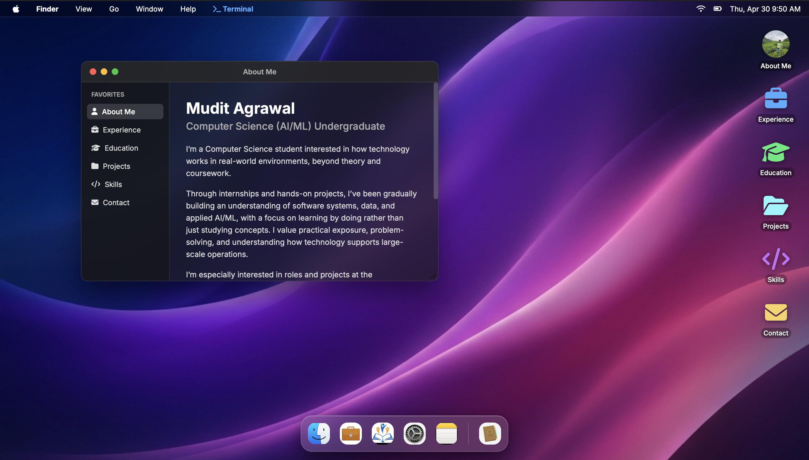
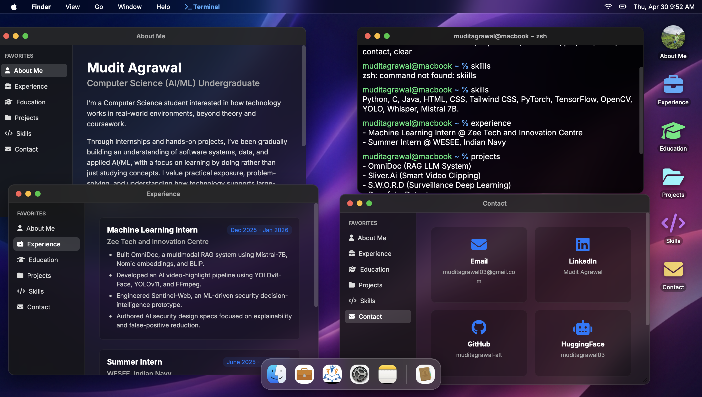
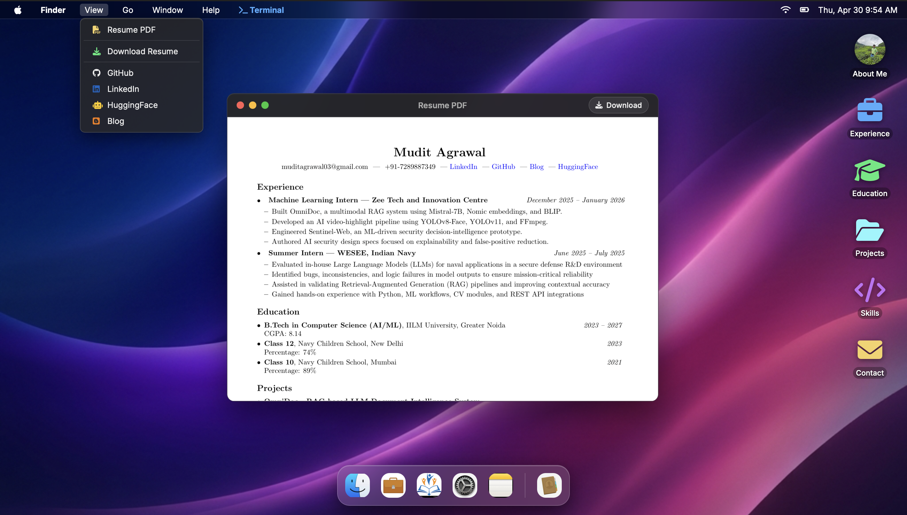

# 🍎 MacOS Portfolio

A fully interactive, MacOS-themed portfolio website built with vanilla HTML, CSS, and JavaScript. Experience a complete desktop environment in your browser, featuring draggable windows, a functional dock, terminal emulator, and authentic macOS design aesthetics.


## 📸 Screenshots

<div align="center">

### Clean Desktop Interface

*MacOS-style window with sidebar navigation and desktop icons*

### Multi-Window Desktop Experience

*About Me, Experience, Contact windows and functional Terminal running simultaneously*

### Resume PDF Viewer & Menu Bar

*Interactive resume viewer with PDF preview and quick access menu*

</div>

## ✨ Features

### 🖥️ Complete Desktop Experience
- **MacOS Menu Bar** - Fully functional top menu bar with Apple menu, Finder, View, Go, Window, and Help menus
- **Desktop Icons** - Double-click to open folders (About, Experience, Education, Projects, Skills, Contact)
- **Draggable Windows** - Click and drag windows anywhere on the desktop
- **Window Controls** - macOS-style traffic lights (close, minimize, maximize)
- **Dock** - Animated dock at the bottom with app icons and tooltips
- **Live Clock** - Real-time clock display in the menu bar
- **Battery Status** - Live battery indicator with charge level and charging status
- **Wi-Fi Indicator** - Connection status display

### 📁 Interactive Windows
Each window features:
- Sidebar navigation for quick access to all sections
- Smooth animations and transitions
- Authentic macOS window styling
- Content-specific layouts (grid, list, card views)

### 💼 Portfolio Sections

#### About Me
Personal introduction and professional overview

#### Experience
- **Machine Learning Intern** - Zee Tech and Innovation Centre (Dec 2025 - Jan 2026)
  - OmniDoc: Multimodal RAG system (Mistral-7B, Nomic, BLIP)
  - AI video-highlight pipeline (YOLOv8-Face, YOLOv11, FFmpeg)
  - Sentinel-Web: ML-driven security decision-intelligence prototype

- **Summer Intern** - WESEE, Indian Navy (June 2025 - July 2025)
  - LLM evaluation for naval applications
  - RAG pipeline validation
  - ML workflows and REST API integrations

#### Education
- B.Tech in Computer Science (AI/ML) - IILM University, Greater Noida
- Class 12 - Navy Children School, New Delhi
- Class 10 - Navy Children School, Mumbai
- Certifications from Stanford, Michigan, Duke, and Deloitte

#### Projects
8 featured projects with live GitHub links:
- **OmniDoc** - RAG-based document intelligence system
- **Sliver.Ai** - Smart video clipping tool
- **S.W.O.R.D** - Real-time weapon detection system
- **Deepfake Detector** - ML-based deepfake and fake news detection
- **Helix-Compiler** - C-based compiler project
- **Multiva.Ai** - Multilingual AI voice cloning platform
- **Inflx** - AutoStream agent service
- **Artifex** - Creative AI project

#### Skills
Comprehensive tech stack including:
- **Languages**: Python, C, Java, HTML, CSS, Tailwind CSS
- **Frameworks**: PyTorch, TensorFlow, Keras, OpenCV, Flask, Gradio, Streamlit
- **Models**: YOLOv8/11/26, Whisper, XTTS, BLIP, Mistral 7B, FB-NLLB, Wav2Lip
- **Tools**: Git, GitHub, Hugging Face, Jupyter, FFMPEG

#### Contact
Direct links to:
- Email
- LinkedIn
- GitHub
- HuggingFace
- Blog
- Phone

### 🖨️ Resume Viewer
- PDF preview with embedded image
- One-click download button
- Full-screen viewing capability

### 💻 Terminal Emulator
Interactive terminal with custom commands:
- Navigate the portfolio
- Display system information
- Execute custom commands
- Authentic terminal styling

## 🚀 Quick Start

### Prerequisites
- Modern web browser (Chrome, Firefox, Safari, Edge)
- No server or build tools required - runs entirely client-side

### Installation

1. **Clone the repository**
```bash
git clone https://github.com/muditagrawal-alt/MacOS_Portfolio.git
cd MacOS_Portfolio
```

2. **Open in browser**
```bash
# Option 1: Direct file open
open index.html

# Option 2: Use a local server (recommended)
python -m http.server 8000
# Then visit http://localhost:8000
```

3. **That's it!** No build process, dependencies, or configuration needed.

## 📂 Project Structure

```
MacOS_Portfolio/
├── index.html              # Main HTML file
├── style.css               # CSS styling
├── script.js               # Main JavaScript logic
├── battery-status.js       # Battery indicator functionality
├── resume-data.js          # Resume data and terminal commands
├── assets/                 # Images and resources
│   ├── Professionalimage.jpeg
│   ├── MuditAgrawalResumeJanuary2026.pdf
│   ├── MuditAgrawalResumePreview.png
│   ├── FINDER.jpeg
│   ├── experience.jpeg
│   ├── education.png
│   ├── PROJECTS.jpeg
│   ├── SKILLS.jpeg
│   ├── CONTACT.jpeg
│   ├── home.png           # About Me window screenshot
│   ├── tabs.png           # Multi-window desktop screenshot
│   └── resume.png         # Resume PDF viewer screenshot
├── .gitignore
├── LICENSE
└── README.md
```

## 🎨 Customization

### Updating Content

1. **Personal Information**: Edit `index.html` sections in each window div
2. **Projects**: Modify the project cards in the `projects-window` div
3. **Skills**: Update skill tags in the `skills-window` div
4. **Contact Info**: Change links in the `contact-window` div
5. **Resume**: Replace PDF and preview image in `assets/`

### Styling

- **Colors**: Modify CSS variables in `style.css`
- **Fonts**: Update Google Fonts link in `index.html`
- **Layout**: Adjust grid and flexbox properties in `style.css`

### Terminal Commands

Add custom commands in `resume-data.js`:
```javascript
// Add your command
case 'yourcommand':
    return 'Your output here';
```

## 🌐 Deployment

### GitHub Pages

1. Go to repository Settings
2. Navigate to Pages section
3. Select main branch as source
4. Your site will be live at `https://yourusername.github.io/MacOS_Portfolio`

### Netlify / Vercel

1. Connect your GitHub repository
2. Deploy with default settings (no build command needed)
3. Custom domain supported

### Manual Hosting

Upload all files to any static hosting service (AWS S3, Firebase Hosting, etc.)

## 🔧 Technical Details

### Pure Vanilla Stack
- **No frameworks** - Built entirely with vanilla HTML, CSS, and JavaScript
- **No dependencies** - Runs without npm, webpack, or build tools
- **No backend** - Fully static, client-side only
- **Lightweight** - Fast load times, minimal resource usage

### Browser Compatibility
- ✅ Chrome/Edge (90+)
- ✅ Firefox (88+)
- ✅ Safari (14+)
- ✅ Mobile browsers (responsive design)

### Features Implementation
- **Drag & Drop**: Custom JavaScript drag handlers
- **Window Management**: Z-index stacking and position tracking
- **Battery API**: Navigator Battery Status API
- **Responsive**: CSS media queries for mobile adaptation
- **Animations**: CSS transitions and transforms

## 📱 Mobile Responsiveness

The portfolio adapts to mobile devices with:
- Collapsible menu bar
- Touch-friendly window controls
- Responsive dock positioning
- Optimized layouts for small screens

## 🤝 Contributing

Contributions are welcome! If you'd like to improve this project:

1. Fork the repository
2. Create a feature branch (`git checkout -b feature/AmazingFeature`)
3. Commit your changes (`git commit -m 'Add some AmazingFeature'`)
4. Push to the branch (`git push origin feature/AmazingFeature`)
5. Open a Pull Request

## 📄 License

This project is licensed under the MIT License - see the [LICENSE](LICENSE) file for details.

## 🙏 Acknowledgments

- Design inspired by macOS Big Sur/Monterey
- Icons from [Font Awesome](https://fontawesome.com/)
- Fonts from [Google Fonts](https://fonts.google.com/)

## 📧 Contact

**Mudit Agrawal**

- Email: muditagrawal03@gmail.com
- LinkedIn: [Mudit Agrawal](https://www.linkedin.com/in/mudit-agrawal-167610318)
- GitHub: [@muditagrawal-alt](https://github.com/muditagrawal-alt)
- HuggingFace: [muditagrawal03](https://huggingface.co/muditagrawal03)
- Blog: [muditagrawal03.blogspot.com](https://muditagrawal03.blogspot.com/)

---

⭐ **Star this repository** if you found it helpful or interesting!

Made with ❤️ and vanilla JavaScript